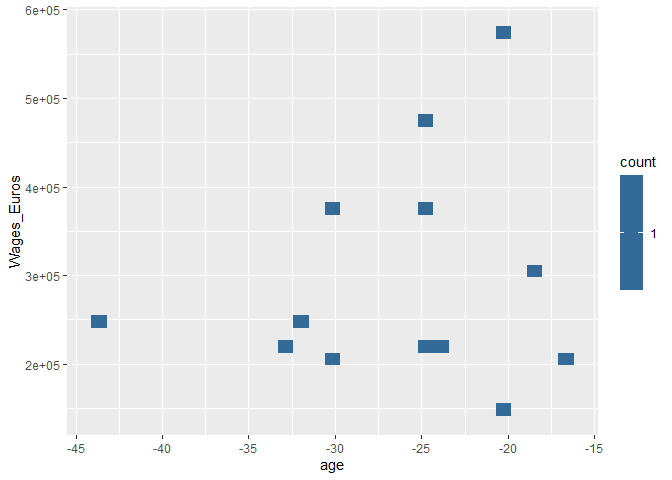
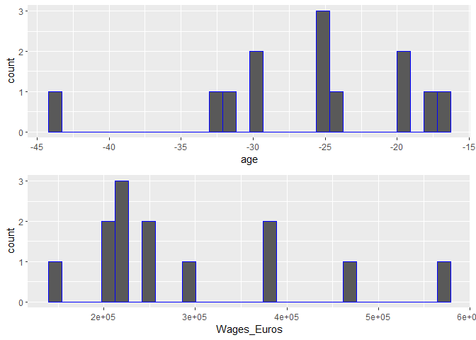

<!-- README.md is generated from README.Rmd. Please edit that file -->

# socceranalysisR

<!-- badges: start -->
<!-- badges: end -->

socceranalysisR is a powerful R package designed to make it easy to
analyze and understand soccer statistics. With its set of functions, you
can quickly obtain summary statistics for a particular team, identify
outliers based on market value, rank players by goals per game and
display different plots. The package is built in a way that allows user
to easily customize the functions to their own interests, giving them
the flexibility to analyze the data in a way that is most meaningful to
them. Whether you’re a coach, a sports journalist or an analyst,
socceranalysisR will help you unlock the insights hidden in your soccer
data and make more informed decisions.

## Functions

1.  `soc_find_team_stat`: provides a quick and easy way to understand
    the descriptive statistics of a team.

2.  `soc_rankingplayers`: Ranks players based on specific attributes

3.  `soc_get_outliers`: Identifes outliers using statistical methods
    (interquartile range or standard deviations)

4.  `soc_viz_stats` : Generates meaningful visualizations to help users
    understand and interpret the numerical data (scatter plots or
    histograms)

## R ecosystem

socceranalysisR can be used in conjunction with other popular R packages
such as [dplyr](https://github.com/tidyverse/dplyr) and
[ML_for_Hackers](https://github.com/johnmyleswhite/ML_for_Hackers) to
perform more advanced data analysis and machine learning tasks. For
example, users can use dplyr to manipulate and clean their soccer data,
and then use this package to perform specific soccer-related analysis on
the cleaned data. Additionally, socceranalysisR can be used in
conjunction with ML_for_Hackers for machine learning tasks on soccer
data. They are designed to be a higher-level, more user-friendly and
declarative interface based on
[ggplot2](https://github.com/tidyverse/ggplot2) for performing specific
soccer-related analysis and visualization tasks. Users can perform
similar visualization using [shiny](https://github.com/rstudio/shiny).
Overall, socceranalysisR is a valuable addition to the R ecosystem as it
provides a specialized tool for analyzing and understanding soccer data
without the need for writing complex code, this can be especially useful
for users who may not have extensive experience with data analysis.

## Installation

You can install the development version of socceranalysisR from
[GitHub](https://github.com/) with:

``` r
# install.packages("devtools")
devtools::install_github("UBC-MDS/socceranalysisR")
```

## Example

This is a basic example which shows you how to solve a common problem:

``` r
library(socceranalysisR)
# Visualization 
## toy data
small_data <- data.frame(age = - c(18, 20, 20, 25, 25, 24, 25, 30, 33, 32, 44, 30, 17),
                         Wages_Euros = c(300000, 575000,    150000, 475000,375000,  225000, 225000, 200000, 225000, 250000, 250000, 375000, 200000))
## scatter plots
soc_viz_stats('age', 'Wages_Euros', T , small_data)
#> Warning: `label_number_si()` was deprecated in scales 1.2.0.
#> ℹ Please use the `scale_cut` argument of `label_number()` instead.
#> ℹ The deprecated feature was likely used in the socceranalysisR package.
#>   Please report the issue to the authors.
```



``` r
## hitograms
soc_viz_stats('age', 'Wages_Euros', FALSE , small_data)
#> `stat_bin()` using `bins = 30`. Pick better value with `binwidth`.
#> `stat_bin()` using `bins = 30`. Pick better value with `binwidth`.
```



``` r

## getting outliers
soc_get_outliers(small_data,Wages_Euros,"SD",2)
#>   age Wages_Euros
#> 1 -20      575000

## Toy data set for ranking
 my_data <- data.frame (Name  = c("Flora", "Mary", "Sarah", "Ester", "Sophie", "Maria"),
second_column = c(1, 4, 3, 5, 1, 6),
third_column  = c(7, 30, 12, 17, 34,8))

 ## ranking players by their names based on attributes
 rankingplayers(my_data, "second_column")
#>     Name second_column
#> 1  Maria             6
#> 2  Ester             5
#> 3   Mary             4
#> 4  Sarah             3
#> 5  Flora             1
#> 6 Sophie             1
```

## Contributors

| Core contributor | Github.com username |
|------------------|---------------------|
| Flora Ouedraogo  | @florawendy19       |
| Gaoxiang Wang    | @louiewang820       |
| Manvir Kohli     | @manvirsingh96      |
| Vincent Ho       | @vincentho32        |

## Contributing

Authors: Vincent Ho, Manvir Singh Kohli, Gaoxiang Wang, Flora Ouedraogo

Interested in contributing? Check out the contributing guidelines.
Please note that this project is released with a Code of Conduct. By
contributing to this project, you agree to abide by its terms.

## License

`socceranalysisR` was created by Gaoxiang Wang, Manvir Kohli, Vincent Ho
and Flora Ouedraogo. It is licensed under the terms of the MIT license.
